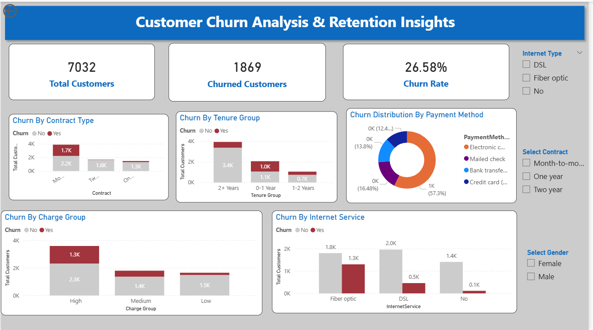
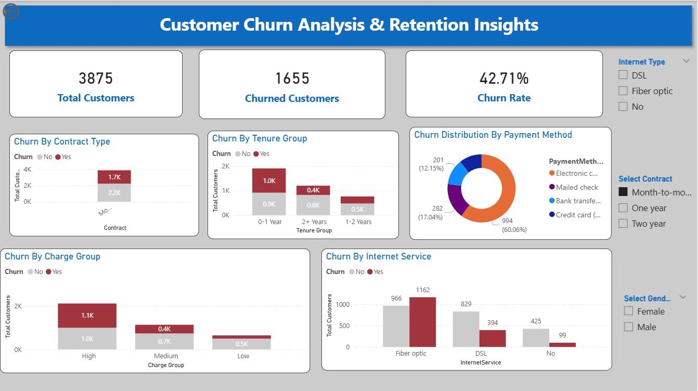

# 📊 Customer Churn Analysis | SQL & Power BI

## 🧾 Executive Summary

This project analyzes telecom customer churn using SQL and Power BI to identify key drivers such as contract type, tenure, and monthly charges. The goal is to help improve customer retention through data-driven insights.

## 📌 Project Overview

This project analyzes customer churn behavior to identify key factors driving customer attrition and provides actionable insights to improve customer retention.  
The analysis uses **SQL for data processing** and **Power BI for visualization**.

## 🎯 Business Problem

Customer churn leads to revenue loss and impacts long-term business growth.  
This project focuses on:

- Identifying customers likely to churn  
- Understanding key churn drivers  
- Providing data-driven recommendations  

## 🛠️ Tools & Technologies

- SQL (Data Cleaning & Analysis)  
- Power BI (Dashboard & Visualization)  

## 🗃️ Dataset
The dataset used in this project is the Telco Customer Churn dataset.

- File name: `telco_customer_churn.csv`
- Source: Kaggle 

## 🧹 Data Cleaning (SQL)

sql
-- Handle missing TotalCharges
UPDATE customers
SET TotalCharges = NULL
WHERE TotalCharges = '';

-- Convert datatype
ALTER TABLE customers
ALTER COLUMN TotalCharges FLOAT;

-- Check duplicates
SELECT customerID, COUNT(*)
FROM customers
GROUP BY customerID
HAVING COUNT(*) > 1;

## 📊 SQL Analysis

🔹 Churn Rate

SELECT 
ROUND(SUM(CASE WHEN Churn = 'Yes' THEN 1 ELSE 0 END) * 100.0 / COUNT(*), 2) AS churn_rate
FROM customers;

🔹 Churn by Contract Type

SELECT Contract,
COUNT(*) AS total_customers,
SUM(CASE WHEN Churn = 'Yes' THEN 1 ELSE 0 END) AS churned_customers
FROM customers
GROUP BY Contract;

🔹 Churn by Tenure Group

SELECT 
CASE 
  WHEN tenure < 12 THEN '0-1 Year'
  WHEN tenure BETWEEN 12 AND 24 THEN '1-2 Years'
  ELSE '2+ Years'
END AS tenure_group,
COUNT(*) AS total_customers,
SUM(CASE WHEN Churn = 'Yes' THEN 1 ELSE 0 END) AS churned_customers
FROM customers
GROUP BY 
CASE 
  WHEN tenure < 12 THEN '0-1 Year'
  WHEN tenure BETWEEN 12 AND 24 THEN '1-2 Years'
  ELSE '2+ Years'
END;

🔹 Monthly Charges Analysis

SELECT 
CASE 
  WHEN MonthlyCharges < 30 THEN 'Low'
  WHEN MonthlyCharges BETWEEN 30 AND 70 THEN 'Medium'
  ELSE 'High'
END AS charge_group,
COUNT(*) AS total_customers,
SUM(CASE WHEN Churn = 'Yes' THEN 1 ELSE 0 END) AS churned_customers
FROM customers
GROUP BY 
CASE 
  WHEN MonthlyCharges < 30 THEN 'Low'
  WHEN MonthlyCharges BETWEEN 30 AND 70 THEN 'Medium'
  ELSE 'High'
END;

🔹 Advanced Analysis

SELECT Contract, InternetService,
COUNT(*) AS total_customers,
SUM(CASE WHEN Churn = 'Yes' THEN 1 ELSE 0 END) AS churned_customers,
ROUND(SUM(CASE WHEN Churn = 'Yes' THEN 1 ELSE 0 END) * 100.0 / COUNT(*), 2) AS churn_rate
FROM customers
GROUP BY Contract, InternetService
ORDER BY churn_rate DESC;

## 📈 Power BI Dashboard

### 🔹 Dashboard Overview

### 🔹 Filtered View

## 📊 Results Summary
Overall churn rate indicates significant customer loss
Month-to-month contracts show the highest churn
Higher monthly charges are linked with increased churn
Customers with less than 2 years tenure are more likely to churn
Fiber optic users show higher churn rates

## 🔍 Key Insights
Month-to-month contracts have the highest churn rate
High monthly charges increase churn probability
Early tenure customers are more likely to leave
Fiber optic users show higher churn
Payment method impacts retention

## 💡 Business Recommendations
Encourage long-term contracts through incentives
Improve onboarding experience for new customers
Focus retention strategies on high-value customers
Review pricing for high-charge segments
Optimize payment experience

## 🚀 Conclusion

This project demonstrates how SQL and Power BI can be used to analyze customer behavior, identify churn patterns, and support data-driven business decisions.

📁 Repository Structure
├── churn_analysis.sql
├── README.md
└── images/
    ├── churn_dashboard.png
    └── churn_filtered_view.png

